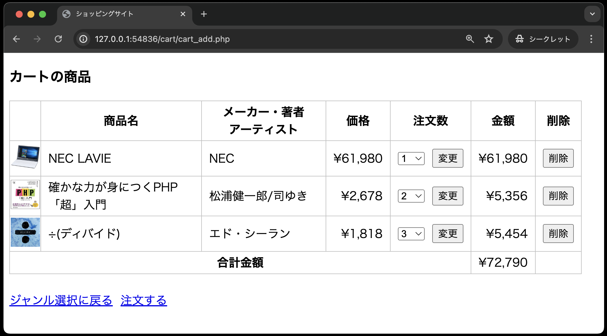
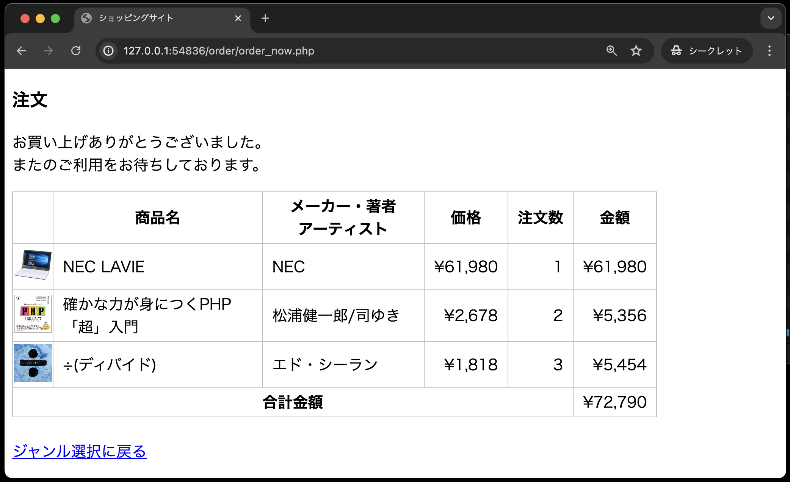
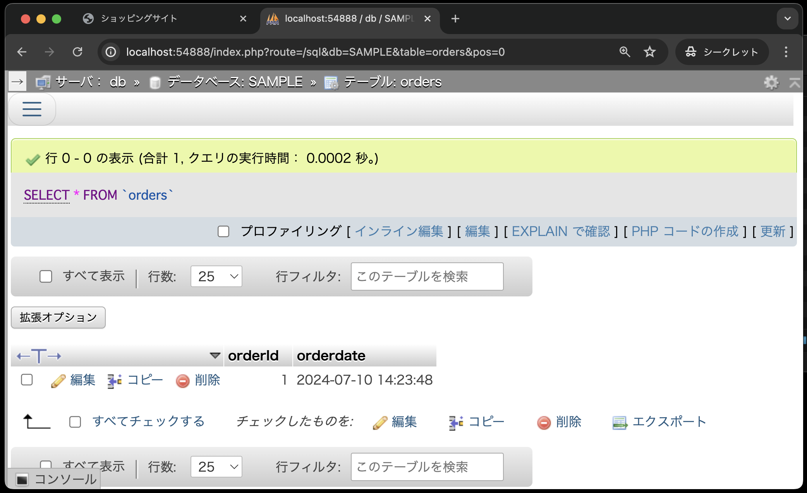
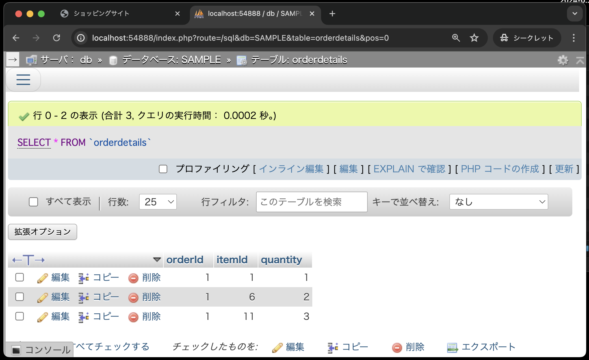
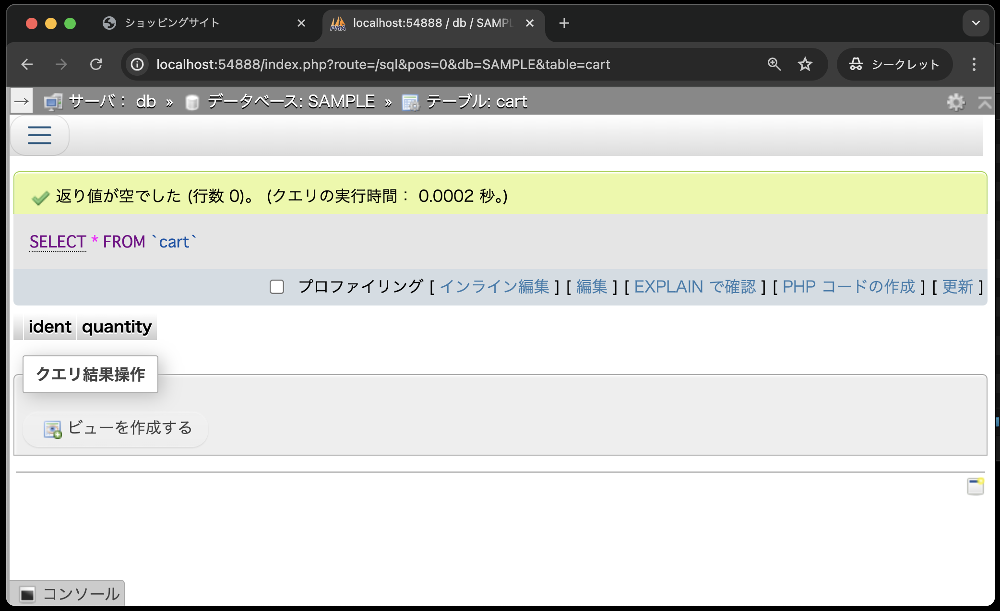

# 仕様書⑤ : 注文画面

1. **「仕様書④」までで作成した`public`ディレクトリ内のソースコードを、今回colneした`public`ディレクトリにコピーしてください。**
ソースコードをコピーすると、以下のようなディレクトリ構成となります。

```text
public
├── cart
│   ├── cart_add.php
│   ├── cart_change.php
│   ├── cart_delete.php
│   └── cart_list.php
├── classes
│   ├── cart.php
│   ├── dbdata.php
│   └── product.php
├── css
│   └── minishop.css
├── images
├── index.php
└── product
    ├── product_detail.php
    └── product_select.php
```

## 本章から追加されたテーブルについて

前章で作成されたテーブル`items`, `cart`に加え、新たにテーブル`orders`, `orderdetails`を作成します。

**テーブル名：orders**

| カラム名 | データ型 | 制約 | 備考 |
| - | - | - | - |
|orderId|int型|主キー、auto_increment|注文番号|
|orderdate|datetime型||注文日時|

**テーブル名：orderdetails**

| カラム名 | データ型 | 制約 | 備考 |
| - | - | - | - |
|orderId|int型|主キー|注文番号(テーブルordersのorderId)|
|itemId|int型|主キー|商品番号|
|quantity|int型||注文数|

※primary keyは「orderId」と「itemId」の複数列を使った複合主キーとします。

## 注文画面(order_now.php)の作成

カート内の商品画面(`cart_list.php`)の「注文する」リンクをクリックすると、

- 注文テーブル`orders`に注文日時を登録し、注文番号を取得する
- 注文明細テーブル`orderdetails`に注文番号と個別の商品情報を登録する
  
の処理を行い、注文した商品の内容を注文画面(`order_now.php`)に表示します。

**カート内の商品画面：cart_list.php**<br>


**注文画面：order_now.php**<br>


この一連の処理を以下の手順で実装していきます。

1. データベースに関わる処理は、`classes/order.php` のクラス`Order` に以下のメソッドとして定義する<br>
  `addOrder`メソッド ・・・ カート内のすべての商品を注文内容として登録するメソッド

1. カート内の商品画面(`cart_list.php`)から送られてくるリクエストを受け取る注文画面(`order_now.php`)には、以下の処理を記述する
   1. クラス`Cart`のオブジェクトを生成し、カート内のすべての商品を取り出すメソッドを呼び出す
   2. クラス`Order`のオブジェクトを生成し、カート内のすべての商品を注文内容として登録するメソッドを呼び出す
   3. 取り出したカート内のすべての商品を画面に表示する(金額と合計金額も表示する)
   4. Cartオブジェクトの全ての商品を削除するメソッドを呼び出し、カート内の全ての商品を削除する

## 注文に関するデータベース操作を行うクラスOrder

データベースの基本事項を定義するクラス`DbData`を継承し、注文に関するデータベース操作を行うクラス`Order`を定義します。<br>
定義するファイルは、`classes/order.php` で、このクラス`Order`にカート内のすべての商品を注文内容として登録する`addOrder`メソッドを以下の仕様で定義します。<br>

```text
アクセス修飾子： public
メソッド名： addOrder
引数： $cartItems(カート内の全ての商品を取り出した結果セット)
戻り値： なし
```

このメソッド内の具体的な処理は以下のとおりです。

1. 注文テーブルに注文日時をセットし、注文データとして登録する
2. 登録した注文データの注文番号を取り出す
3. 引数で受け取った$cartItemsの各商品に注文番号をセットしたデータを注文明細テーブルに登録する

【ヒント】

- 注文テーブルにセットする注文日時は以下のフォーマットを用いれば、MySQLのDATETIME型と一致する<br>
**date("Y-m-d H:i:s")**
- 登録した注文データの注文番号は「auto_increment」で採番されるので、以下の処理で取得することができる

```php
// last_insert_id( )は、直前にinsertされたデータのauto_incrementの値を返すMySQLの関数
$sql = "SELECT last_insert_id( ) FROM orders";
$stmt = $this->query( $sql,  [ ] );
$result = $stmt->fetch( );
$orderId = $result[ 0 ]; // auto_incrementで登録された注文番号(orderId)の値を取得する
```

## Cart.classに、カート内の全ての商品を削除するclearCartメソッドを作成

受け取る引数も戻り値もなく、テーブル`cart`にあるすべての商品を削除する「全商品削除メソッド」を以下の仕様で定義します。

```text
アクセス修飾子: public
メソッド名: clearCart
引数: なし
戻り値: なし
```

## 注文画面(order_now.php)

この画面の完成形は以下のとおり。<br>


この画面と以下の処理概要を参考に、order/order_now.php を作成してください。

1. Cartオブジェクトを生成する
2. Cartオブジェクトの`getItems`メソッドを呼び出し、カート内のすべての商品を取り出す
3. Orderオブジェクトを生成する
4. Orderオブジェクトの`addOrder`メソッドを呼び出し、データベースに登録する
5. 取り出したカート内のすべての商品を画面に表示する(金額と合計金額も表示する)
6. Cartオブジェクトの`clearCart`メソッドを呼び出し、カート内の全ての商品を削除する

## ディレクトリ構成の確認

動作確認をする前に、ディレクトリ構成が以下のようになっていることを確認してください。

```text
public
├── cart
│   ├── cart_add.php
│   ├── cart_change.php
│   ├── cart_delete.php
│   └── cart_list.php
├── classes
│   ├── cart.php
│   ├── dbdata.php
│   ├── order.php ←本章で追加
│   └── product.php
├── css
│   └── minishop.css
├── images
├── index.php
└── order
│   └── order_now.php ←本章で追加
└── product
    ├── product_detail.php
    └── product_select.php
```

## 動作確認

カートに複数の商品を入れ、カート内の商品画面(cart_list.php)の「注文する」リンクをクリックすると 注文画面(order_now.php)にカート内の全ての商品が表示され、データベースの注文テーブルと 注文明細テーブルにデータが登録されていることを確認する。

カート内の商品画面：cart_list.php<br>
「注文する」リンクをクリックする<br>
<br><br>

注文画面：order_now.php<br>


注文テーブル(`orders`)と注文明細テーブル(`orderdetails`)には、以下のようにデータが追加されます。
また、カートテーブル(cart)は空になっています。

- 注文テーブル: **orders**<br>
  
  
- 注文明細テーブル: **orderdetails**<br>
  

- カートテーブル: **cart**<br>
  
